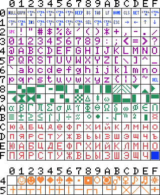

# Конвертер текстов созданных на MSX в кодировку UTF-8
Таблица символов MSX:

   16   |    10   | Описание 
--------| ------- | ---------------------------------------------------------------------------------
0x00-0x1F, 0x7F |	00-31, 127 | Специальные (управляющие) символы
0x20-0x7E | 32-126 |	Эти символы соответствуют международной раскладке
0x80-0xBE |	128-190 | 0xBF (191) — знак валюты, 0xС0-0xFE (192-254) — русские буквы, набор символов в основном соответствует KOI8-R, за исключением того, что на MSX отсутствуют буквы «Ъ», «Ё» и «ё».
0xFF      | 255     | Курсор
0x40-0x5F | 64-95   | Графические символы, для обращение к ним используется префикс 0x01 (1)

Для подбора UTF символов использовался сайт https://unicode-table.com/ru/ проекта 

Пока не подобраны замены для символов с кодами:

 16    |   10 
------ | ------
0x85    | 133
0x01+0x50  | 1+80
0x01+0x5F  | 1+95

Проект был создан для работы над файлами книги 

## Основных программы
**msx_russian-utf8.py** скрипт для конвертирования одного файла

**msx2file.bas** программа для вывода таблицы кодов символов в файл test.msx

**test.msx** файл созданный программой msx2file.bas

**test.txt** результат работы скрипта msx_russian-utf8.py с файлом test.msx

### msx_russian-utf8.py
Скрипт работает в Python 2 и 3

Скрипт производит побайтовое чтение исходного файла (в кодировке MSX), в зависимости от значения байта выполняется его замена (конвертирование) и сохранение в специальную переменную. После достижения конца исходного файла сконвертированная последовательность байт сохраняется из переменной в конечный файл.

Пример: ./msx_russian-utf8.py test.msx test.txt

### msx_russian-utf8-batch_mode.sh
Скрипт для конвертирования нескольких файлов.

Для его работы нужно задать переменные:

` files_path='.' `путь к исходным и конечным файлам

` file_ext_msx='.msx' `расширение исходного файла (MSX)

` file_msx_mask='test' `	маска исходных файлов, без расширения (MSX)

` file_ext_utf='.txt'	` расширение конечного файла (UTF-8)

## Дополнительные программы

**msx2scrn.bas** вывод таблицы кодов символов на экран

**msxfont1.bas** вывод символов на экран шириной 16 символов

**msxfont2.bas** вывод символов на экран шириной 32 символа
