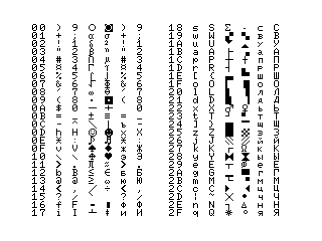
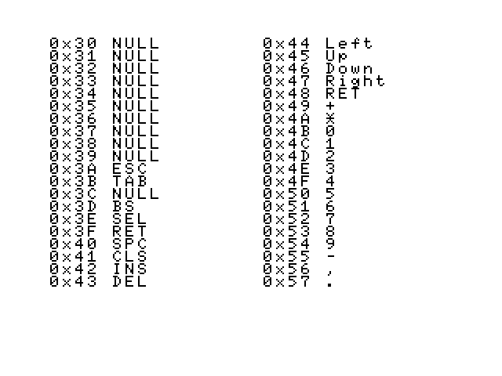

# Инструменты для работы с таблицей матрицы клавиатуры.

Таблица состоит из двух частей:
1. смещение 0x0DA5, длина 288 байт
2. смещение 0x1033 (0x0FF8 для MSX 2+), длина 40 байт

### table-to-text.py
Чтение файла BIOS и сохранение таблицы матрицы клавиатуры в файл.

Параметры:
1. Исходный файл
2. Файл для сохранения таблицы

Пример запуска:
`./table-to-text.py file.bin table.txt`

Каждая строка выходного файла `table.txt` содержит **№ клавиши** и **коды** закреплённые за ней в различных режимах:

Режим | Описание 
------| ---------- 
1 | Без модификаторов
2 | С нажатой клавишей SHIFT
3 | С нажатой клавишей GRAPH
4 | С нажатыми клавишами GRAPH+SHIFT
5 | С нажатой клавишей РУС	
6 | С нажатыми клавишами РУС+SHIFT

##### Формат:
№ Клавиши | Код символа в режиме 1 | Код символа в режиме 2 | Код символа в режиме 3 | Код символа в режиме 4 | Код символа в режиме 5 | Код символа в режиме 6 
----------| --------------------- | --------------------- | --------------------- | --------------------- | --------------------- | --------------------- | 
0x00 | 30 | 29 | 09 | 0A |  29 | 30
   … | … | … | … | … | … | … |
0x57 |2E | | | | |  | 

Для таблицы, часть 1 для каждой из 48 клавиш выводятся коды для кажого из 6 режимов, а для таблицы, часть 2 для её 16 клавиш по одному коду.

### text-to-table.py
Вывод значений таблицы из тестового файла в тестовую программу на BASIC и в готовые файлы таблиц.

Параметры:
1. Исходный файл
2. Имя файл (без расширения)

Пример запуска:
`./text-to-table.py table.txt table`

В результате для файла `table.txt` будут сформированы следующие файлы:
- `table.bas` — тестовая программа на BASIC
- `table_0DA5-288.bin` — файл с первой частью таблицей
- `table_1033-40.bin`  — файл с второй частью таблицей

Для изменения исходного файла используйте команды:
- `../tools/fragment-to-binary-file.py file.bin table_0DA5-288.bin 0DA5 288`
- `../tools/fragment-to-binary-file.py file.bin table_1033-40.bin 1033 40`

### [USSR.txt](USSR.md)
Оригнальная таблица компьютеров стандарта MSX 2 которые поставлялись в СССР.

Примеры таблиц, соформированные программой на BASIC для [USSR.txt](USSR.txt):
##### Таблица, часть 1
На экране в две колонки отображаются значения всех 48 символьных клавиш клавиатуры, они нумеруются по порядку их описания в матрице клавиатуры (для экономии места на экране префикс 0x отсутствует). Для каждой клавиши указаны символы которые отображаются при её нажатии в каждом из 6 режимов.

##### Таблица, часть 2

На экране в две колонки отображаются значения клавиш, номер клавиши с префикса 0x

### [JCUKEN.txt](JCUKEN.md)
Исправленная таблица.

Цифры, точка и запятая нажимаются в нижнем регистре — без SHIFT.

Рекомендована для использования на "железных" компльютерах.

### 
Исправленная латиница с JCUKEN на QWERTY. Изменения сделаны для использования с текущей версией [WebMSX](https://github.com/ppeccin/WebMSX).

### International.txt
Оригинальная интернациональная таблица.
