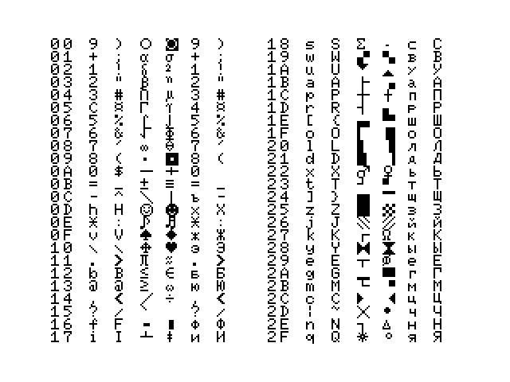
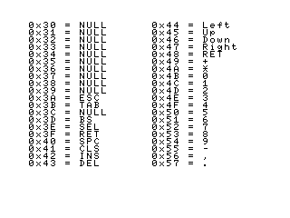

Таблицы матрицы клавиатуры.

### table-to-text.py
Чтение файла BIOS и сохранение таблицы матрицы клавиатуры в файл.

Параметры:
1. Исходный файл
2. Файл для сохранения таблицы

Пример запуска:
`./table-to-text.py file.bin table.txt`

Каждая строка выходного файла (таблицы) содержит **№ клавиши** и **коды** закреплённые за ней в различных режимах:

Режим | Описание 
------| ---------- 
1 | Без модификаторов
2 | С нажатой клавишей SHIFT
3 | С нажатой клавишей GRAPH
4 | С нажатыми клавишами GRAPH+SHIFT
5 | С нажатой клавишей РУС	
6 | С нажатыми клавишами РУС+SHIFT

№ Клавиши | Код символа в режиме 1 | Код символа в режиме 2 | Код символа в режиме 3 | Код символа в режиме 4 | Код символа в режиме 5 | Код символа в режиме 6 
----------| --------------------- | --------------------- | --------------------- | --------------------- | --------------------- | --------------------- | 
0x00 | 30 | 29 | 09 | 0A |  29 | 30
   … | … | … | … | … | … | … |
0x57 |2E | | | | |  | 

### text-to-table.py
Вывод значений таблицы из тестового файла в тестовую программу на BASIC и в готовые файлы таблиц.

Параметры:
1. Исходный файл
2. Имя файл (без расширения)

Пример запуска:
`./text-to-table.py table.txt table`

В результате для файла table.txt будут сформированы следующие файлы:

`table.bas` - тестовая программа на BASIC

`table_0DA5-288.bin` — файл с первой таблицей

`table_1033-40.bin`  — файл с второй таблицей

Для изменения исходного файла используйте команды:

`../tools/fragment-to-binary-file.py table_0DA5-288.bin 0DA5 288`

`../tools/fragment-to-binary-file.py table_1033-40.bin 1033 40`

### MSX_1.txt
Оригнальная таблица компьютеров стандарта MSX 1

### MSX_2.txt
Оригнальная таблица компьютеров стандарта MSX 2

### MSX.txt
Исправленная таблица. Цифры, точка и запятая нажиаются в нижнем регистре — без SHIFT.

Примеры таблиц:

